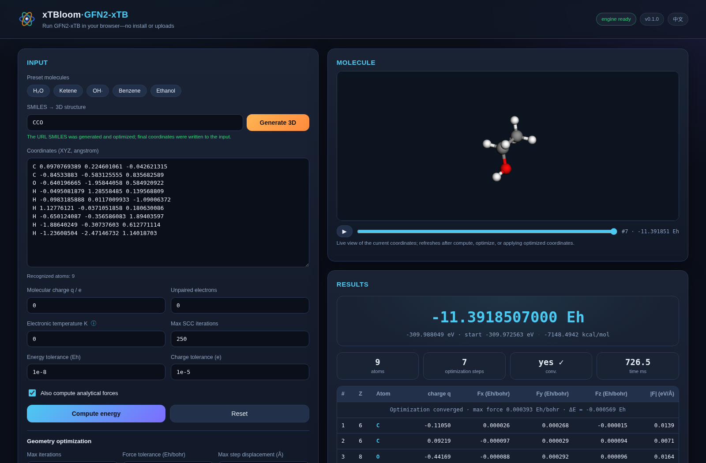

<!--
README design principles:
- Keep this page a concise project entry point: identity, differentiating
  capabilities, minimal installation and quickstart, measured headline
  evidence, supported scope, and navigation.
- Keep examples runnable and centered on the primary workflow. Do not
  accumulate feature tutorials, implementation notes, or exhaustive options.
- Put detailed behavior, caveats, theory, validation, and workflow-specific
  guidance in the linked documentation.
-->

# xTBloom


**Native, batched GFN-xTB inference for C, C++, Python, and CUDA.**

[Try it in your browser](https://xtbloom.jinzhezeng.group) ·
[Python guide](docs/user-guide/python.md) ·
[C/C++ guide](docs/user-guide/c-api.md) ·
[Documentation](docs/index.md)

xTBloom is a C++17 library for applications that need energies,
analytic forces, and atomic charges for many small and medium molecular
systems. Its CPU and CUDA backends share one stable C ABI, with Python, ASE,
and dpdata interfaces built on the same native execution path.

## Try xTBloom in your browser

[](https://xtbloom.jinzhezeng.group/?smiles=CCO)

The [fully client-side demo](https://xtbloom.jinzhezeng.group) turns SMILES or
XYZ coordinates into an interactive GFN1-xTB or GFN2-xTB calculation without
an install or server upload. GFN2-xTB remains the default. The screenshot shows
ethanol generated from `CCO`, optimized, and evaluated with GFN2-xTB in the
browser build prepared by this repository.

The browser's SMILES-to-3D workflow and L-BFGS optimizer are demonstration
adapter features. The native library API remains focused on reusable
single-point inference. See the [browser demo guide](docs/user-guide/browser-demo.md)
for usage and scope.

## Why xTBloom

- **Native ragged batches.** Differently sized molecules share one call without
  padding every system to the largest atom or orbital count.
- **One model-aware API.** Restricted and unrestricted GFN1-xTB and GFN2-xTB
  run on CPU and CUDA through the same stable public model selector.
  The low-level CUDA path accepts caller-owned host, device, or mixed buffers.
- **Failure isolation.** SCC or eigensolver failure is local to one batch
  member; successful peers remain valid and failed slices receive NaNs plus
  per-system diagnostics.
- **Analytic derivatives and embedding.** Both models return CPU/CUDA energies,
  QM forces, charges, optional point-charge forces, and caller-supplied charge
  response. GFN2 additionally publishes uniform-field and dipole paths.
- **Reusable execution state.** Contexts retain CPU workers, CUDA workspaces,
  fixed-topology plans, and compatible electronic warm starts.
- **One deployment boundary.** C, C++, Python, ASE, and dpdata all call the same
  versioned, caller-buffer C ABI.

## Python quickstart

[](https://pypi.org/project/xtbloom/)

Install from PyPI with Python 3.10 or newer:

```console
pip install xtbloom
# Or add CUDA 12 user-space libraries on supported Linux systems:
pip install "xtbloom[cuda12]"
```

Wheels support Linux, macOS, and Windows; CUDA is available on Linux x86_64 and
aarch64 and still requires an NVIDIA driver and GPU. See the
[Python guide](docs/user-guide/python.md) for extras and the
[installation guide](docs/user-guide/index.md#installation) for platform and
source-build details.

Positions use bohr; energies and forces are returned in Hartree and
Hartree/bohr. The high-level Python `electronic_temperature` argument is in
kelvin.

```python
import numpy as np
from xtbloom import Calculator

numbers = np.array([8, 1, 1])
positions = np.array(
    [
        [0.0000000000, 0.0000000000, -0.7357858611],
        [1.4418315287, 0.0000000000, 0.3678929305],
        [-1.4418315287, 0.0000000000, 0.3678929305],
    ]
)

backend = "cuda"  # Use "cpu" to require CPU execution instead.
with Calculator("GFN2-xTB", numbers, positions, backend=backend) as calc:
    result = calc.singlepoint()

print(result["energy"])
print(result["forces"])
print(result["charges"])
```

See the [Python guide](docs/user-guide/python.md) for ragged batches, direct
device arrays, point charges, ASE, dpdata, and PyTorch integration. Molecular
relaxation is available through the
[direct Python geometry optimizer](docs/user-guide/optimization.md).

Native consumers can install the CMake package and link
`xtbloom::xtbloom`. The [C/C++ guide](docs/user-guide/c-api.md) contains a
complete runnable example and the descriptor ownership rules.

## Measured batch throughput


CUDA curves were measured on an NVIDIA GeForce RTX 5090 (driver 580.95.05).
The xTBloom CPU series was refreshed on 2026-08-29, the xTBloom CUDA series
on 2026-08-20, and third-party series remain pinned to their unchanged
2026-08-09 evidence.

On the recorded AMD EPYC 7K62 system with the same 16-thread CPU budget:

- for a warm-state batch of 128 distinct 62-atom alkane conformers, xTBloom CPU
  completed the energy-plus-forces call 9.3x faster than the compared xTB
  public-API loop and 8.3x faster than the tblite loop;
- for a cold-state batch of 512 at 62 atoms, the measured speedups were 9.9x
  and 11.8x.

These are correctness-qualified medians of three timed samples per coordinate
for one workload, hardware setup, and timing protocol—not a general ranking of
xTB implementations. Batch 1 is retained in the figure as latency context, and
the panels use the start policies stated in the evidence. Read the
[user-facing performance summary](docs/user-guide/performance.md), the
[benchmark methodology](benchmarks/cross-engine.md), and the
[latest machine-readable table](benchmarks/natoms_cross_engine_latest.csv).
The [CPU refresh](benchmarks/evidence/issue-498/2026-08-29-node3/README.md),
[RTX 5090 CUDA refresh](benchmarks/evidence/issue-467/2026-08-20-node3/README.md),
and [historical third-party evidence](benchmarks/evidence/issue-13/2026-08-09-node3-pr231/README.md)
retain the commands, identities, hashes, and limitations needed before reusing
the numbers.

## Supported scope

| Capability | Status |
| --- | --- |
| Restricted and unrestricted GFN2-xTB energy, forces, and charges | CPU and CUDA |
| Restricted and unrestricted GFN1-xTB energy, forces, and charges | CPU and CUDA |
| Ragged batches and peer-local numerical failures | Supported |
| Host input/output descriptors | CPU and CUDA |
| CUDA-device and mixed descriptors | Low-level C ABI |
| Explicit point charges in SCC and point-charge forces | GFN1 and GFN2 |
| Caller-supplied periodic charge response | GFN1 and GFN2; separate from the native-cell ABI |
| Native-cell descriptors | ABI-v4 validates `NONE`/`XYZ`; periodic execution returns `NOT_IMPLEMENTED` |
| Uniform electric field and molecular dipoles | GFN2 CPU and CUDA; not published for GFN1 |
| ASE and dpdata integrations | GFN1 and GFN2 |
| Direct Python and dpdata geometry optimization | Higher-level GFN1 CPU and GFN2 CPU/CUDA adapters |
| ASE-driven molecular dynamics | Supported for molecular systems through ASE integrators; no native xTBloom MD driver |
| Numerical QM Cartesian Hessian | Python `Calculator` and `BatchCalculator`; [batched analytic-force differences](docs/user-guide/python.md#numerical-cartesian-hessians) |
| Array API/DLPack | GFN1 and GFN2 |
| PyTorch autograd | GFN1 and GFN2; positions gradient `dE/dR = -F` only |
| Vibrational analysis | Python mass weighting, rigid-mode projection, frequencies, and normal modes from numerical Hessians; [guide](docs/user-guide/vibrations.md) |
| Browser single points, SMILES-to-3D, and demo optimization | Experimental client-side GFN1/GFN2 CPU/WASM adapter; GFN2 is the default |
| ROCm, solvation, native optimization/MD drivers, analytic/C-ABI Hessians, periodic GFN1/GFN2 execution | Not implemented |

Reserved ABI values are not reported as supported features. At finite
electronic temperature, the reported variational energy is the electronic
Helmholtz free energy.

## When xTBloom is a good fit

Choose xTBloom when an embedded application needs native ragged batches, a
stable C deployment boundary, direct CUDA buffers, or peer-local failure
handling. Choose [xTB](https://github.com/grimme-lab/xtb) for its broad CLI and
workflow coverage, [tblite](https://github.com/tblite/tblite) for a mature
extensible per-structure library including periodic inputs, and
[dxtb](https://github.com/grimme-lab/dxtb) when PyTorch-native differentiation
and response properties are central.

## Documentation

- [Documentation home](docs/index.md)
- [User guide](docs/user-guide/index.md)
- [Browser demo](docs/user-guide/browser-demo.md)
- [Python API](docs/user-guide/python.md)
- [Direct Python geometry optimization](docs/user-guide/optimization.md)
- [Vibrational analysis](docs/user-guide/vibrations.md)
- [ASE molecular dynamics](docs/user-guide/ase-md.md)
- [C and C++ API](docs/user-guide/c-api.md)
- [QM/MM usage](docs/user-guide/qmmm.md)
- [Skills for AI agents](docs/user-guide/agent-skills.md)
- [Theory guide](docs/theory/index.md)
- [Developer guide](docs/developer-guide/index.md)
- [Benchmark harnesses](benchmarks/README.md)

## Acknowledgements and provenance

xTBloom builds on the scientific work and open implementations of the xTB and
tblite communities. xTB provides independent numerical oracle evidence and the
reference point-charge convention; tblite supplies pinned GFN2 parameter
material and important implementation guidance. Exact revisions, hashes,
derived artifacts, and license terms are recorded in
[`THIRD_PARTY_NOTICES.md`](THIRD_PARTY_NOTICES.md) and the linked manifests.

## AI authorship

xTBloom is an AI-first software project. Coding agents wrote most of the
library, CUDA backend, bindings, tests, and documentation under human-defined
scientific, legal, and release goals. Git commits, pull requests, and issue
checkpoints record the agent, client version, model, and reasoning effort.
Independent conformance evidence, parity tests, finite differences, ABI tests,
sanitizers, and package inspection remain required.

## License

xTBloom is licensed under `GPL-3.0-or-later`, with the narrowly scoped
[CUDA and Intel MKL additional permission](CUDA_MKL_LINKING_EXCEPTION).
Third-party material remains under the separate terms in
[`THIRD_PARTY_NOTICES.md`](THIRD_PARTY_NOTICES.md).
