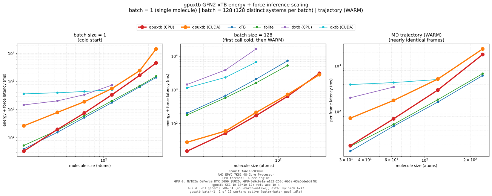

# gpuxtb


gpuxtb is a native GFN2-xTB inference library for workloads made of many
small and medium molecular systems. It combines a C++17 implementation, CPU
and CUDA backends, one stable C ABI, and Python interfaces built on that same
ABI.

The current pre-release implements restricted and unrestricted GFN2-xTB
energies, analytic forces, and atomic charges. It is designed for reusable
contexts and ragged batches rather than wrapping a command-line calculation
once per molecule.

## Features

- **Native ragged batches.** Molecules share one call without padding every
  system to the largest atom or orbital count.
- **CPU and CUDA parity.** Both backends implement restricted and unrestricted
  GFN2-xTB. The CUDA ABI accepts caller-owned host, device, or mixed buffers.
- **Failure isolation.** SCC or eigensolver failure in one molecule publishes
  NaNs and diagnostics for that molecule without discarding successful peers.
- **Analytic derivatives.** Energies, QM forces, atomic charges, and optional
  point-charge forces are available through the public API.
- **QM/MM inputs inside SCC.** Explicit point charges and caller-supplied
  periodic charge-response operators participate in every SCC iteration.
- **Reusable execution state.** Contexts retain CPU workers, CUDA workspaces,
  fixed-topology plans, and strict compatible electronic warm starts.
- **One deployment boundary.** C, C++, Python, ASE, and dpdata all call the
  same versioned, caller-buffer C ABI.

GFN1-xTB and ROCm have reserved ABI values but are **not implemented**.
gpuxtb also does not currently provide geometry optimization, molecular
dynamics, solvation, Hessians, or a lattice/PBC descriptor.

## Choosing an xTB implementation

The projects below serve different workflows. This is a capability comparison,
not a general performance ranking.

| Project | Best fit | Methods | Batch and accelerator model |
| --- | --- | --- | --- |
| **gpuxtb** | Native high-throughput inference embedded in C/C++ or Python applications | GFN2-xTB | Ragged C-ABI batches; CPU and CUDA; caller-owned host/device buffers |
| [xTB](https://github.com/grimme-lab/xtb) | Broad end-user computational chemistry workflows | GFN0/1/2-xTB, GFN-FF, and more | Mature CLI and per-system library APIs; OpenMP and optional NVIDIA build paths |
| [tblite](https://github.com/tblite/tblite) | Lightweight, extensible single-point library | GFN1-xTB, GFN2-xTB, IPEA1-xTB | Fortran/C/Python per-structure APIs; CPU/OpenMP; molecular and periodic inputs |
| [dxtb](https://github.com/grimme-lab/dxtb) | Differentiable xTB in PyTorch and ML workflows | GFN1-xTB, GFN2-xTB | Batched PyTorch tensors on CPU/CUDA; autodiff forces and response properties |

### Where gpuxtb is deliberately stronger

gpuxtb makes several production-inference guarantees first-class rather than
leaving them to each calling application:

- A failed SCC or eigensolve is isolated to one ragged-batch member. Successful
  peers remain valid, while every requested floating-point slice for the failed
  member is replaced with quiet NaNs and accompanied by per-system diagnostics.
- Exactly degenerate finite-temperature occupations have a documented
  binary64 publication policy. In a reproduced three-hydrogen edge case,
  gpuxtb returns a finite result where xTB, tblite, or dxtb fail on at least one
  integer-charge variant; the exact versions, inputs, and outcomes are
  [documented](docs/developer-guide/architecture.md#cross-engine-degenerate-occupation-evidence).
- Explicit point-charge screening and caller-supplied periodic charge response
  enter every SCC iteration. The same stable C ABI returns both QM and
  point-charge forces. This covers embedding inputs that remain unavailable or
  incomplete in the compared xTB/tblite C interfaces.
- The high-level Python API accepts electronic temperature in kelvin, CPU work
  partitioning is tested for bit-identical results, and strict `WARM` calls
  never silently fall back to a fresh solve.
- Archived, correctness-qualified CPU evidence shows strict `WARM` reducing
  SCC work from 17-18 iterations to 2 and running 1.09x-1.54x faster than a
  persistent tblite calculation for the measured 32-122 atom alkane corpus.

The [user-guide comparison](docs/user-guide/index.md#where-gpuxtb-is-stronger)
links each claim to its upstream issue, local regression test, or archived raw
benchmark evidence.

### Cross-engine scaling benchmark

The figure below is a correctness-qualified, end-to-end steady-state
comparison of GFN2-xTB energy + analytic forces from public interfaces only:
gpuxtb CPU (16 threads) and gpuxtb CUDA versus vanilla xTB, tblite, and dxtb.
Every batch of 128 is built from 128 *distinct* thermal-like conformers of one
alkane (identical atomic numbers, different coordinates), so no engine can
win by reusing one geometry. The MD-trajectory panel streams nearly identical
frames and runs gpuxtb with strict `WARM` SCC continuation, its documented
massively-parallel mode.



Hardware: AMD EPYC 7K62 (48 cores; every engine uses the same 16-thread budget
per call) and an NVIDIA RTX 5090 (32 GiB) for the CUDA rows. gpuxtb runs the
conformance-tight SCC (tolerance 1e-10 on charges /
1e-12 on energy, up to 500 iterations) while the reference engines use their
default `--acc 1e-4`, so gpuxtb's timings include strictly *more* SCC work.
Start semantics are explicit per panel: batch=1 rows are genuine cold-start
(every sample rebuilt from scratch, xTB/tblite rebuild their calculator);
batch=128 rows cold-start on the first call and continue warm afterwards, like
a repeated steady-state workflow; the trajectory panel is strictly `WARM`
(nearly identical MD frames). Reference adapters run the same 16-thread budget
as gpuxtb (OpenMP/OpenBLAS/MKL on xTB and tblite, Torch intra-op on dxtb).
The CPU rows were measured from main-tree commit `81e3d67`; the CUDA rows were
re-measured at the merged head (including the #252/#254/#257 CUDA fixes).
Raw samples, hardware, and the exact commits are archived under
[`benchmarks/evidence/issue-256/2026-08-09-node3/`](benchmarks/evidence/issue-256/2026-08-09-node3/).

The measured pattern is what ragged high-throughput inference is for:

- **Single molecule, cold start (batch = 1):** gpuxtb CPU is competitive with
  xTB/tblite at small sizes (14-32 atoms) and 1.3-3.0x slower at 62-362 atoms
  (242: gpuxtb 1680 ms vs xTB 651 ms / tblite 708 ms; 362: 4660 vs 1406 /
  1545). The gap is per-SCC-iteration cost plus gpuxtb's strictly tighter
  tolerance, and gpuxtb's batch-parallel worker pool is idle for a single
  system (same latency at 1 and 16 threads); closing it is tracked in
  [issue 256](../../issues/256). xTB 6.7.1 crashes on the 602-atom alkane so
  the reference sweeps stop at 362.
- **128 systems per call (batch = 128, first call cold then WARM):** is where
  gpuxtb separates. From 14 to 122 atoms gpuxtb CPU is roughly 9-13x faster
  than xTB and tblite per call (62 atoms: 174 ms vs xTB 2113 ms / tblite 1635
  ms; 122: 651 ms vs 7395 / 5342), because gpuxtb solves the whole ragged
  batch in one call across its worker pool while the reference adapters loop
  systems serially. gpuxtb CPU extends the sweep to 302 atoms (3115 @242 ->
  5424 ms @302); CUDA and the references stop earlier (the RTX 5090 cannot
  hold 128 x 302 systems and the reference bindings were capped in the
  archived matrix). dxtb CPU rows reset per call by design, so they stay cold.
- **MD trajectory (WARM):** per-frame latency at 32-242 atoms. gpuxtb CPU is
  1.3-2.9x slower than xTB/tblite at the largest sizes here too (242: 1786 ms
  vs xTB 620 / tblite 684), again from per-iteration cost plus tighter SCC
  tolerance; gpuxtb's strict WARM continuation is the exact path an ASE MD run
  takes.
- **gpuxtb CUDA:** at batch=1 the GPU rows carry a fixed per-call overhead
  (27-192 ms at 14-62 atoms; 362 atoms is dominated by a slow force stage at
  14 629 ms). At batch=128 the overhead amortizes and CUDA is in the same
  range as CPU (@242 x 128 systems: CUDA 2852 ms vs CPU 3115 ms; @14: 28 ms
  vs 15 ms), well ahead of the serial reference loops.

Reproduce it with the committed runner, then regenerate the figure:

```bash
# batch = 1 cold-start matrix (panel 1); run once per engine group:
srun -n 1 -c 16 python3 benchmarks/natoms_cross_engine.py \
  --library build/bench-cpu-shared/libgpuxtb.so.0.1.0 \
  --xtb-library /path/to/libxtb.so.6.7.1 \
  --tblite-library /path/to/libtblite.so.0.7.0 \
  --engines gpuxtb-cpu,xtb,tblite --natoms 14,32,62,122,242,362 \
  --batch-sizes 1 --warmups 1 --repetitions 5 --cpu-threads 16 \
  --start-policy cold \
  --output-json build/benchmarks/final/cold.json --output-csv build/benchmarks/final/cold.csv

# batch = 128 auto-warm matrix (panel 2), ngine=same but --batch-sizes 128
# --natoms-large-batch 14,32,62,122 --start-policy auto-warm, then:
# trajectory panel (WARM) with --trajectory flags, then:
python3 benchmarks/plot_natoms_cross_engine.py \
  --artifact build/benchmarks/final/cold.json --artifact build/benchmarks/final/b128.json \
  --artifact build/benchmarks/final/traj.json \
  --commit "$(git rev-parse HEAD)" \
  --output docs/assets/natoms_cross_engine.svg
```

xTB and tblite expose the same `libtblite.so.0` SONAME but need different
tblite versions, so run their rows in separate processes (as the archived
evidence does). dxtb rows need its dedicated environment. Plotting requires
matplotlib in the active Python environment.

The same public-API protocol measures energy-only and force workloads, host or
device pointers, and ragged mixed chemistry; see the
[benchmark harness](benchmarks/README.md) for scope and limits.

Choose xTB for its broad CLI workflows, optimizers, dynamics, solvation, and
method coverage. Choose tblite for a mature reusable single-point library with
periodic structures and customizable components. Choose dxtb when PyTorch
autodiff and differentiable response properties are central. Choose gpuxtb
when the application needs a native ragged batch, a stable deployment ABI,
direct CUDA buffers, or peer-local failure handling.

Published benchmark claims are deliberately workload-specific. Reproducible
protocols and raw results live under [`benchmarks/evidence`](benchmarks/evidence/).

## Python quickstart

gpuxtb is being prepared for publication on PyPI. Once a release is published,
install the CPU runtime with:

```console
python -m pip install gpuxtb
```

Optional integrations and CUDA 12 host libraries are extras:

```console
python -m pip install "gpuxtb[ase,dpdata]"
python -m pip install "gpuxtb[cuda12]"
```

Until the first PyPI release, install a source checkout as a non-editable
package. `GPUXTB_ENABLE_CUDA=OFF` makes the intended backend explicit:

```console
GPUXTB_ENABLE_CUDA=OFF python -m pip install .
```

Positions are in bohr. Energies and forces are returned in Hartree and
Hartree/bohr; the high-level Python `electronic_temperature` argument is the
temperature in kelvin.

```python
import numpy as np
from gpuxtb import Calculator

numbers = np.array([8, 1, 1])
positions = np.array(
    [
        [0.0000000000, 0.0000000000, -0.7357858611],
        [1.4418315287, 0.0000000000, 0.3678929305],
        [-1.4418315287, 0.0000000000, 0.3678929305],
    ]
)

with Calculator("GFN2-xTB", numbers, positions, backend="auto") as calc:
    result = calc.singlepoint()

print(result["energy"])
print(result["forces"])
print(result["charges"])
```

`BatchCalculator` submits multiple `Structure` objects in one native call.
The high-level Python API uses host NumPy arrays even when the selected backend
is CUDA; direct CUDA-device descriptors are available through the low-level C
ABI.

See the [Python user guide](docs/user-guide/python.md) for batching, spin,
point charges, ASE, and dpdata, or the concise
[PyPI package page](python/README.md).

## C and C++ quickstart

Native consumers need CMake 3.24 or newer, a C++17 compiler to build gpuxtb,
and one dlopen-able monolithic LP64 LAPACKE+CBLAS runtime for CPU inference.
An explicitly selected MKL runtime also requires its matching LP64,
sequential, and core component libraries in the same provider directory.
Shared installs place gpuxtb's private MKL shim beside `libgpuxtb`. Static
consumers that use MKL must stage that installed shim beside the final
executable; CMake consumers can copy
`$<TARGET_FILE:gpuxtb::mkl_lp64_shim>` when that optional imported target is
present. Without the sibling artifact, CPU inference fails with
`GPUXTB_STATUS_BACKEND_UNAVAILABLE` instead of using the host's `libmkl_rt`.
The public consumer API itself is C11-compatible and is wrapped in `extern "C"`
for C++.

```console
cmake -S . -B build/release -G Ninja \
  -DGPUXTB_ENABLE_CUDA=OFF \
  -DBUILD_SHARED_LIBS=ON \
  -DCMAKE_BUILD_TYPE=Release
cmake --build build/release --parallel
cmake --install build/release --prefix "$PWD/build/install"
```

If auto-discovery cannot find the CPU numerical runtime, configure its absolute
path with `-DGPUXTB_CPU_LINALG_LIBRARY=/path/to/libopenblas.so` or a compatible
LP64 `libmkl_rt`.

Installed CMake consumers use the exported target:

```cmake
find_package(gpuxtb CONFIG REQUIRED)
target_link_libraries(my_program PRIVATE gpuxtb::gpuxtb)
```

Every extensible descriptor must be initialized before its fields are set.
The complete request and all caller-owned output buffers are then submitted in
one synchronous call:

```c
#include <gpuxtb/gpuxtb.h>

gpuxtb_context_options_t context_options;
gpuxtb_batch_t batch;
gpuxtb_compute_options_t compute_options;
gpuxtb_batch_result_t result;

gpuxtb_context_options_init(&context_options, sizeof(context_options));
gpuxtb_batch_init(&batch, sizeof(batch));
gpuxtb_compute_options_init(&compute_options, sizeof(compute_options));
gpuxtb_batch_result_init(&result, sizeof(result));

/* Populate batch and result with caller-owned buffers. */
compute_options.flags = GPUXTB_COMPUTE_ENERGY | GPUXTB_COMPUTE_FORCES;

gpuxtb_context_t *context = NULL;
gpuxtb_context_create(&context_options, &context);
gpuxtb_status_t status = gpuxtb_compute(context, &batch, &compute_options, &result);
gpuxtb_context_destroy(context);
```

The [C API guide](docs/user-guide/c-api.md) contains a complete runnable
single-molecule example plus descriptor, units, CUDA-memory, and failure
semantics. The installed header
[`include/gpuxtb/gpuxtb.h`](include/gpuxtb/gpuxtb.h) is the normative API.

## Documentation

- [Documentation index](docs/index.md)
- [User guide](docs/user-guide/index.md)
- [Theory guide](docs/theory/index.md)
- [Developer guide](docs/developer-guide/index.md)
- [Python package documentation](python/README.md)

## Acknowledgements and provenance

gpuxtb exists because the xTB and tblite communities made both the scientific
method and high-quality reference implementations available. During gpuxtb's
design and implementation, coding agents studied the xTB and tblite source
code to understand equations, numerical conventions, edge cases, and public
interface behavior. xTB also serves as an executable numerical oracle and the
reference for explicit point-charge coupling. tblite supplies pinned GFN2
parameter material and strongly influenced the familiar shape of the Python
interface. We thank their authors and contributors.

This acknowledgement is not a substitute for legal provenance. Redistributed
or derived parameter data, oracle outputs, source material, revisions, hashes,
and license terms are recorded in
[`THIRD_PARTY_NOTICES.md`](THIRD_PARTY_NOTICES.md) and the linked manifests.

## AI authorship

gpuxtb is an AI-first software project. The core library architecture,
scientific implementation, CUDA backend, bindings, tests, and documentation
were designed and written primarily by AI coding agents rather than as a
conventional manually authored implementation. Humans provide project goals,
scientific and release decisions, review, infrastructure, and legal ownership.
Git commits, pull requests, and issue checkpoints record the exact coding
agent, client version, model, and reasoning effort used for agent-authored work.

This development model does not relax the correctness standard: conformance
uses pinned independent xTB/tblite evidence, CPU/CUDA parity, analytic-force
finite differences, ABI tests, sanitizers, install consumers, and package
inspection.

## License

gpuxtb is licensed under `GPL-3.0-or-later`, with the narrowly scoped
[CUDA and Intel MKL additional permission](CUDA_MKL_LINKING_EXCEPTION).
Upstream material remains under the separate terms in
[`THIRD_PARTY_NOTICES.md`](THIRD_PARTY_NOTICES.md).
