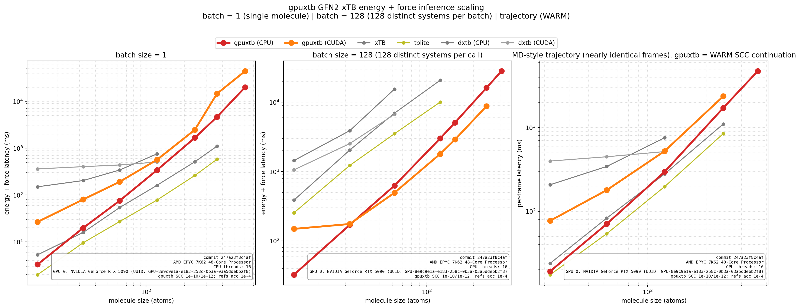

# User guide

gpuxtb is a single-point GFN2-xTB inference library. It is most useful when an
application needs many independent molecules, reusable native state, direct
CUDA integration, or a stable C deployment boundary.

## Where gpuxtb is stronger

gpuxtb deliberately specializes in embedded, high-throughput inference. The
following advantages are public contracts with regression or archived evidence,
not expectations that callers must reconstruct from implementation details.

| Production concern | gpuxtb contract | Comparison evidence |
| --- | --- | --- |
| Failure containment | A per-system SCC or eigensolver failure is local to one ragged-batch member. Healthy peers remain valid; every requested floating-point slice for the failed member is quiet NaN, with status and iteration diagnostics. | [dxtb #223](https://github.com/grimme-lab/dxtb/issues/223) shows how unconverged default SCF produced batch-dependent apparent energies until stronger settings were supplied. gpuxtb instead makes nonconvergence explicit and preserves peers in [Python](../../python/tests/test_batch.py) and [native](../../tests/cpu_public_inference_test.cpp) public-API tests. |
| Degenerate finite-temperature occupations | Exactly degenerate orbitals receive symmetric binary64 occupations. A target between representable symmetric states uses the nearest state under a documented electron-count bound instead of failing unpredictably. | The [three-hydrogen comparison](../developer-guide/architecture.md#cross-engine-degenerate-occupation-evidence) records finite gpuxtb results alongside xTB 6.7.1, tblite 0.6/0.7, and dxtb 0.4 failures or invalid output on integer-charge variants. |
| QM/MM embedding | Each external point charge has an explicit screening `gamma`; the interaction participates in every SCC iteration, and both QM and point-charge forces are available. A caller-supplied periodic `b + A q` response can participate in the same variational solve. | xTB [#920](https://github.com/grimme-lab/xtb/issues/920) tracks the missing point-charge-hardness setter in its C API. tblite [#22](https://github.com/tblite/tblite/issues/22) tracks external point charges and [#33](https://github.com/tblite/tblite/issues/33) tracks general C interaction bindings. See [QM/MM usage](qmmm.md) for gpuxtb's exact scope. |
| Temperature-unit safety | The high-level Python API accepts kelvin and converts explicitly to the native `k_B T` Hartree scale. | tblite [#73](https://github.com/tblite/tblite/issues/73) records a real `temperature=300` mistake that meant `300 Eh` and changed an energy from about `-31.716 Eh` to `-31158.785 Eh`. gpuxtb keeps atomic units in the C ABI while making the Python boundary unit explicit. |
| Reproducible work partitioning | For a fixed backend and configuration, explicit CPU thread counts, repeated fresh calls, and automatic batch slicing are tested for bit-identical results. | xTB [#999](https://github.com/grimme-lab/xtb/issues/999) records thread-count-dependent optimized structures; version 6.7.1 greatly reduced the effect but still reported small differences. gpuxtb's narrower guarantee is enforced by [native thread](../../tests/cpu_public_inference_test.cpp) and [Python batch-slicing](../../python/tests/test_auto_batch.py) tests. |
| Strict electronic reuse | Native `WARM` consumes only a fully converged compatible checkpoint. A first call or identity mismatch fails atomically and never silently falls back to `FRESH`; high-level Python `warm_start=True` builds a transparent policy on top by retrying that rejection once with `FRESH`. | The [issue #168 evidence](../../benchmarks/evidence/issue-168/2026-08-06-epyc7k62/README.md) covers 360 correctness-qualified samples: 17-18 SCC iterations fell to 2, gpuxtb WARM was 3.09x-4.76x faster than gpuxtb FRESH and 1.09x-1.54x faster than persistent tblite on the measured 32-122 atom alkanes. |
| Ragged batch throughput | One public call solves a whole ragged batch of distinct molecules on CPU or CUDA; per-system cost collapses well below a serial per-system loop. | The [issue #13 scaling benchmark](index.md#cross-engine-scaling-benchmark) and its [archived evidence](../../benchmarks/evidence/issue-13/2026-08-08-node3/README.md) show gpuxtb CPU solving 128 distinct 14-122 atom systems about 11x faster than xTB, about 5.6x faster than tblite, and about 25x faster than dxtb CPU at 62 atoms. |

These are scoped advantages, not a claim that gpuxtb replaces every xTB-family
package. xTB provides much broader end-user workflows and method coverage;
tblite provides periodic structures and mature extensibility; dxtb provides
PyTorch autodiff and response properties. gpuxtb is the stronger fit when the
priority is a stable native ABI, ragged CPU/CUDA inference, direct device
buffers, explicit failure semantics, and reproducible reusable state.

### Cross-engine scaling benchmark



The figure compares steady-state GFN2-xTB energy + analytic forces from public
interfaces only: gpuxtb CPU (16 threads) and gpuxtb CUDA versus xTB, tblite,
and dxtb. Every batch of 128 uses 128 *distinct* thermal-like conformers of an
alkane (identical atomic numbers, different coordinates) so no engine can win
by reusing one geometry. The trajectory panel streams nearly identical frames;
gpuxtb uses strict `WARM` continuation there.

- **batch = 1**: gpuxtb CPU stays in the same range as xTB and tblite at small
  sizes. Its strength is collecting systems into batches, not running them one
  at a time. The sweep reaches 602-atom alkanes for gpuxtb; the references stop
  at 362 atoms (xTB 6.7.1 segfaults on the 602-atom alkane).
- **batch = 128**: gpuxtb CPU is about 11x faster than xTB, about 5.6x faster
  than tblite, and about 25x faster than dxtb CPU at 62 atoms, and ~6.9x / ~3.3x
  at 122 atoms. gpuxtb CPU reaches 302-atom x 128 systems; gpuxtb CUDA leads
  the ragged batch from 62 atoms up (495 ms vs 627 ms per 128-system call at 62
  atoms) and reaches 242 x 128 systems within the 32 GiB GPU.
- **MD trajectory**: the trajectory panel sweeps molecule size (32-242 atoms)
  on the x-axis. gpuxtb CPU matches xTB per-frame time at every size while
  running conformance-tight SCC, and gpuxtb CUDA's strict `WARM` continuation
  is substantially faster than starting each frame fresh.

Hardware: AMD EPYC 7K62 with gpuxtb CPU pinned to 16 workers, plus an NVIDIA
GeForce RTX 5090 (sm_120). gpuxtb runs SCC to charge tolerance 1e-10 and energy
tolerance 1e-12 while the reference engines use their default `--acc 1e-4`, so
gpuxtb's timings include strictly more SCC work. Raw samples, revisions, and
reproduction commands are archived under
[`benchmarks/evidence/issue-13/2026-08-08-node3/`](../../benchmarks/evidence/issue-13/2026-08-08-node3/).

## Installation paths

### Python

gpuxtb is being prepared for its first PyPI release. Published releases use:

```console
python -m pip install gpuxtb
python -m pip install "gpuxtb[ase,dpdata]"  # optional integrations
python -m pip install "gpuxtb[cuda12]"      # optional CUDA 12 host libraries
```

See the [Python guide](python.md) for runtime requirements and examples.

### C and C++

Build a shared or static native SDK with CMake 3.24 or newer:

```console
cmake -S . -B build/release -G Ninja \
  -DGPUXTB_ENABLE_CUDA=OFF \
  -DBUILD_SHARED_LIBS=ON \
  -DCMAKE_BUILD_TYPE=Release
cmake --build build/release --parallel
cmake --install build/release --prefix "$PWD/build/install"
```

`GPUXTB_ENABLE_CUDA` accepts `OFF`, `ON`, or `AUTO`. Use `ON` when a CUDA build
is required; `AUTO` is convenient for local exploration but can legitimately
produce a CPU-only build when `nvcc` is absent.

CPU inference requires one monolithic LP64 LAPACKE+CBLAS runtime that can be
opened dynamically. gpuxtb can discover a compatible system OpenBLAS or MKL,
or the build can record an absolute provider with
`GPUXTB_CPU_LINALG_LIBRARY`. The library still loads without that provider,
but CPU eigensolver-backed inference then reports a diagnostic rather than
silently using an incompatible BLAS.

Continue with the [C and C++ guide](c-api.md).

## Units and result meaning

The native ABI uses IEEE binary64 and atomic units:

| Quantity | Native and high-level Python unit |
| --- | --- |
| Positions | bohr |
| Energy | Hartree |
| Forces | Hartree/bohr |
| Charge | elementary-charge units |
| Point-charge screening `gamma` | Hartree |

The high-level Python API accepts `electronic_temperature` in kelvin and
converts it internally. The C ABI accepts the energy scale `k_B T` in Hartree.

At finite electronic temperature, `energy` is the variational electronic
Helmholtz free energy, including the Fermi-occupation entropy term. `forces`
is its negative coordinate derivative. Python also exposes `gradient`, which
is exactly `-forces`.

When periodic `b` or `A` operators are supplied, gpuxtb holds them fixed while
differentiating. The result flag
`GPUXTB_RESULT_FORCES_EXCLUDE_EXTERNAL_OPERATOR_DERIVATIVES` tells native
callers that `db/dR` and `dA/dR` are not included.

## Backends and memory

- `CPU` runs systems in parallel at the outer batch layer and keeps the BLAS
  provider single-threaded within each worker.
- `CUDA` runs the same model equations and accepts host, CUDA-device, or mixed
  descriptors through the C ABI.
- `AUTO` prefers CUDA when the backend is compiled, a compatible device is
  present, and initialization succeeds; otherwise it selects CPU.

The high-level Python interface always submits host NumPy arrays. It can still
execute on CUDA, but the native runtime stages those arrays. Applications that
already own device memory should use the C ABI to avoid staging copies.

Public compute is synchronous. Active CUDA stream capture is rejected; an
asynchronous public ABI is not currently implemented.

## Failure behavior

gpuxtb separates request failures from per-system numerical failures.

- Invalid descriptors, unsupported settings, allocation failures, and other
  call-level errors return a failing `gpuxtb_status_t`. Before caller-output
  commit, outputs and result flags remain unchanged.
- SCC nonconvergence or eigensolver failure for one molecule is a data-level
  result. The call succeeds, diagnostics identify the failed molecule, and all
  requested floating-point slices for that molecule are filled with quiet
  NaNs. Successful peers remain available.

Python `BatchCalculator.compute()` preserves this peer-local behavior by
default. Call `BatchResult.raise_for_status()` or pass
`raise_on_failure=True` for exception-oriented control flow.

## Scope and limitations

Only GFN2-xTB is implemented. GFN1-xTB and ROCm are reserved so the ABI can
grow without reusing numeric tags, but requesting them returns an unsupported
or not-implemented status.

gpuxtb has no lattice input. Its periodic charge-response API accepts fields
computed by another electrostatics program; it does not make the QM calculation
periodic by itself. Geometry optimization, molecular dynamics, solvation,
vibrational analysis, and Hessians belong in calling applications or other xTB
implementations.
